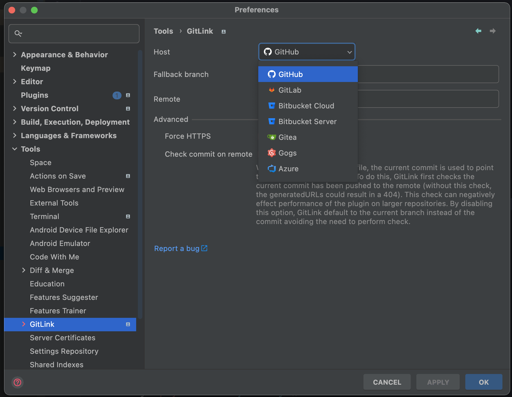

# GitLink

<!-- Plugin description -->

A Jetbrains plugin providing shortcuts to open or copy a file, directory or commit in `GitHub`, `Bitbucket`, 
`GitLab`, `Gitee` `Gitea`, `Gogs`, `Azure` or `Gerrit`. Custom hosts can also be configured using the URL template syntax.

<!-- Plugin description end -->

  

  

## Usage

Install the plugin and configure your remote host if it hasn't been auto-detected already:

      Preferences → Tools → GitLink

Make sure you have registered your projects root under the version control preferences:

      Preferences → Version Control (see unregistered roots)

To open the current file in the default browser:

      View → Open in (your selected host) or
      Select in... → Browser (GitLink)

Additional shortcuts are available including from the editor gutter and Git log window.

A URL can be generated in one of the following ways: 

* File at a commit
* File at a branch
* Commit

By default, when generating a URL to a file, the latest commit hash is used, creating a reference to a fixed version of 
the file's content. If the latest commit has not been pushed to the remote, the current branch is used instead. 
While this avoids generating a URL to a 404, it does mean the linked contents can change over time.

## Installation

- Using IDE built-in plugin system:

  <kbd>Settings/Preferences</kbd> > <kbd>Plugins</kbd> > <kbd>Marketplace</kbd> > <kbd>Search for "GitLink"</kbd> >
  <kbd>Install Plugin</kbd>

- Manually:

  Download the [latest release](https://github.com/ben-gibson/GitLink/releases/latest) and install it manually using
  <kbd>Settings/Preferences</kbd> > <kbd>Plugins</kbd> > <kbd>⚙️</kbd> > <kbd>Install plugin from disk...</kbd>

## Support

* Star the repository
* [Rate the plugin](https://plugins.jetbrains.com/plugin/8183-gitlink)
* [Share the plugin](https://plugins.jetbrains.com/plugin/8183-gitlink)
* [Become a Backer or Sponsor](https://opencollective.com/gitlink)

  
## Change log

Please see [CHANGELOG](CHANGELOG.md) for more information what has changed recently.

## Contributing

Please see [CONTRIBUTING](CONTRIBUTING.md) for details.

## License

Please see [LICENSE](LICENSE) for details.
