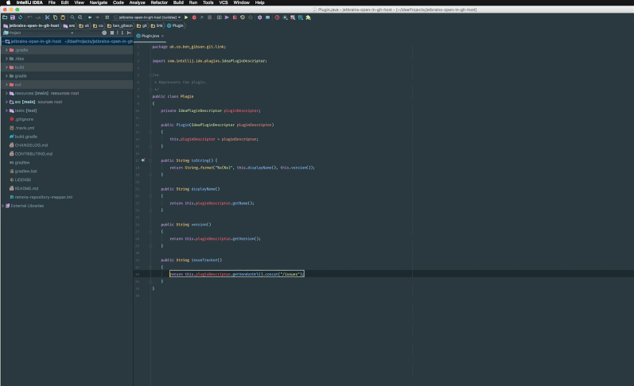

<h1 align="center">GitLink</h1>

    <strong>A Jetbrains plugin that provides shortcuts to open a file or commit in GitHub, Bitbucket, GitLab, Gitea,
    Gogs or GitBlit using the default browser.</strong>

    
    
    
    
    
    

  

Installation
-------------------------------------------------------------------------------

This plugin is published on the
[JetBrains Plugin Repository](https://plugins.jetbrains.com/plugin/8183):

    Preferences → Plugins → Browse Repositories → Search for "GitLink"

### From Source

Clone this repository:

    $ git clone https://github.com/ben-gibson/GitLink
    $ cd GitLink

Update the permissions:

     $ chmod +x ./gradlew

Build the plugin zip file:

    $ ./gradlew buildPlugin

Install the plugin from `./build/distributions/GitLink-*.zip`:

    Preferences → Plugins → Install plugin from disk

Development
-------------------------------------------------------------------------------

Update the permissions:

     $ chmod +x ./gradlew

Execute an IntelliJ IDEA instance with the plugin you're developing installed:

    $ ./gradlew runIdea

Run the tests:

    $ ./gradlew test

Usage
-------------------------------------------------------------------------------

After installing the plugin set your remote host and enabled extensions in the preferences:

      Preferences → Other Settings → GitLink
      
Make sure you have registered your projects root under the version control preferences:

      Preferences → Version Control (see unregistered roots)
      
For custom hosts, you need to enter your git url in the "GitLink" setting:

e.g.: custom gitlab server

| | | |
| ----- |:-------------:| -----:|
| File at commit | https://[GITLAB.HOST]/[GITLAB.NAMESPACE]/[GITLAB.PROJECT]/commit/{commit}/{filePath}/{fileName}#L{line} | you need to repalce [GITLAB.HOST], [GITLAB.NAMESPACE] and [GITLAB.PROJECT] |
| File on branch | https://[GITLAB.HOST]/[GITLAB.NAMESPACE]/[GITLAB.PROJECT]/blob/{branch}/{filePath}/{fileName}#L{line}   | you need to repalce [GITLAB.HOST], [GITLAB.NAMESPACE] and [GITLAB.PROJECT] |
| Commit         | https://[GITLAB.HOST]/[GITLAB.NAMESPACE]/[GITLAB.PROJECT]/commit/{commit}                               | you need to repalce [GITLAB.HOST], [GITLAB.NAMESPACE] and [GITLAB.PROJECT] |

To open the current file in the default browser:

      View → Open in (your selected host) or
      Select in... → Browser (GitLink)

Shortcuts are also available on the annotation gutter and VCS log window.

When viewing a file, the URL generated references the current commit unless that commit does not exist on the remote
repository in which case it references the current branch instead. If the current branch also does not exist on the
remote repository the default branch defined in the plugin configuration is used instead.

Change log
-------------------------------------------------------------------------------

Please see [CHANGELOG](CHANGELOG.md) for more information what has changed recently.

Contributing
-------------------------------------------------------------------------------

Please see [CONTRIBUTING](CONTRIBUTING.md) for details.

### Credits

License
-------------------------------------------------------------------------------

Please see [LICENSE](LICENSE) for details.
